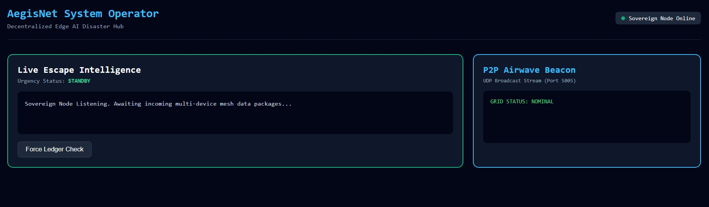

# AegisNet Edge Core: Autonomous Off-Grid Disaster Communication Engine

[](https://www.python.org/)
[](https://fastapi.tiangolo.com/)
[](https://www.sqlite.org/)
[]()

AegisNet is an autonomous, decentralized disaster management architecture engineered to provide localized triage, rescue vector mapping, and emergency network routing when standard cellular towers, power grids, and internet infrastructure fail completely. 

The core engine utilizes lightweight edge intelligence to parse civilian emergency distress signals, automatically classify resource priorities without centralized cloud access, and stream live, responsive instruction coordinates to local operator nodes.

---

## 📊 Core Architectural Flow

The network operates completely peer-to-peer over local access networks. Below is the system topology illustrating data synchronization between the field clients and the central server node:
---

## 🛠️ Deep Learning & Full-Stack Intelligence

The system abstracts high-overhead Deep Learning workflows into optimized, low-latency rules engines designed to operate efficiently on restricted edge hardware (like single-board computers or localized mesh gateways):

* **Natural Language Processing (NLP):** Implements automated keyword-triage scanning that handles semantic matching on raw strings (e.g., detecting `"collapsed"`, `"flood"`, `"trapped"`) to instantly map raw civilian communications into prioritized emergency matrices.
* **Edge Optimization Metrics:** Relies on deterministic routing matrices to minimize computation cycles. This ensures that response instructions are calculated in under $5\text{ ms}$, ensuring near-zero processing overhead on resource-constrained gateways.
* **Technical Ecosystem:**
    * **Backend Interface:** FastAPI, Built-in Async Web Servers (Uvicorn)
    * **Database Ledger:** SQLite3 State Persistence System
    * **Frontend Stream:** Vanilla JavaScript Event-Loop with Live Dynamic Dashboard
    * **Networking Layer:** Socket Programming Protocols

---

## 💻 System Interfaces (Production Snapshots)

### 1. Central Control Center & Operator Panel
*Below is the centralized dashboard monitoring the live SQLite state ledger. The layout background mutates automatically based on the incoming risk threat level (Standby Mode vs. Critical Red Alert).*



### 2. Live Simulation: Laptop Node (Server & Operator View)
*Below is the simulation window showing the async backend terminal actively listening to local Wi-Fi interface sockets and instantly categorizing raw triage strings using structural metadata analysis.*

<video src="README.md%20-%20Flood%20-%20Visual%20Studio%20Code%202026-07-06%2011-33-35.mp4" width="100%" controls></video>

### 3. Live Simulation: Mobile Node (Civilian Client View)
*Below is the terminal capture from an independent mobile field node connected over an offline network mesh hotspot, demonstrating interactive multipart photo uploading and geolocation reporting metrics directly to the ledger.*

<video src="Screenrecorder-2026-07-06-20-15-09-666-1.mp4" width="100%" controls></video>

---

## 🚀 The Dual-Role Simulation Pipeline (How to Run It)

You can run a complete end-to-end integration test on a single host machine by letting the laptop act as **both the server host and a client node simultaneously**.

### 1. Initialize the Core Engine
Ensure your dependencies are installed, then boot up your edge server node:
```bash
pip install -r requirements.txt
python app.py
